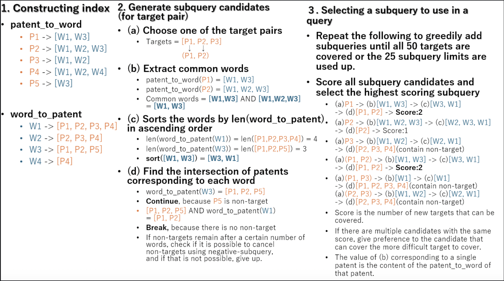
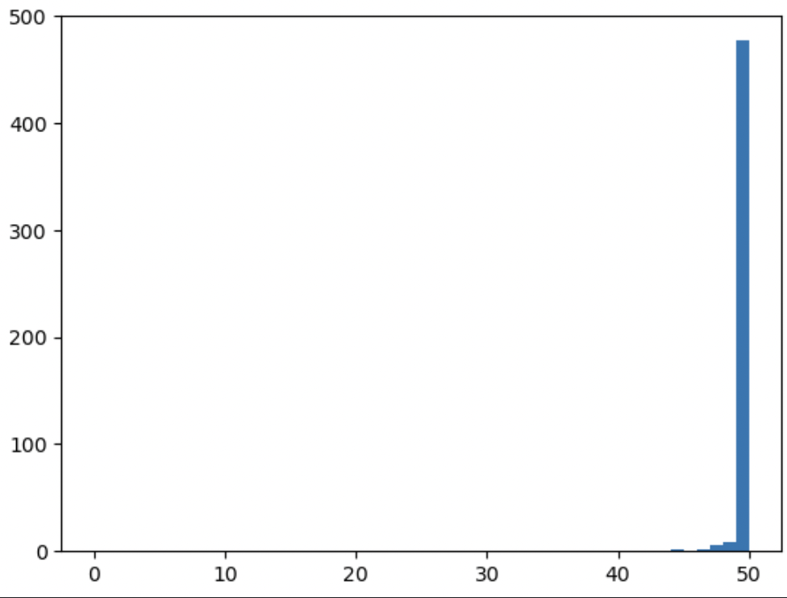

# Winning approach by Shun_PI

Team Members - shunrcn

REF: https://www.kaggle.com/competitions/uspto-explainable-ai/discussion/522258

## Magic

There are two (maybe unnoticed by the host) magics in this competition, and I used the former in my solution.

1. no whitespace AND
   `ti:"abcd"ab:"efgh"clm:"ijkl"`
2. no whitespace n-gram
   `ti:"abcd/efgh/ijkl"` (there are several possible delimiters other than the slash)

If you notice one of the two magics, you can get a score above 0.8 even with a simple solution like identifying 1 patent in 1 subquery.

Without magic, the best submitted LB was 0.90. However, since I found magic, I focused on improving the solution using it, and I think there is much room for improvement in the solution without magic.

## Insights on Metrics and Test Dataset

- I suspect that the test_index contains non-targets that are similar to target intentionally. This can be guessed from the fact that when you submit a solution using a query that may include several non-targets, you get a large CV-LB gap, e.g., CV:0.8 vs. LB:0.5.
- According to the Whoosh Docs, the order of query results is ordered using TF-IDF scores, and it is difficult to control this order.
- This competition's metric has the nature that query results that do not include non-targets will have significantly higher scores. For example, the expected value of metric for 25 targets and 25 non-targets is 0.50 (if the order is random as said in previous discussion), but for 25 targets and 0 non-targets it is 0.84.
- From the above discussion, we can see that the solution to construct a query that always has zero non-targets is good.
- To achieve this, we can aim for a solution like "construct an index with data from all patents, and make a query that is determined to contain no non-targets". However, it is difficult to build Whoosh with all patent data, so it is necessary to build my own fast search algorithm.

## Validation

- I obtained a high correlation with LB by constructing the following CV
  - Randomly select 2,500 rows from 1975 or later where title/abstract/claims/description are non-null.
  - Based on the above discussion, limit queries to those that do not include non-targets and absorb the CV/LB gap caused by intentional addition of non-targets in LB.

## Solution

- In the final solution, the query looks like this
  - query = (subquery1 OR subquery2 OR …) NOT (negative-subquery1 OR negative-subquery2 OR …)
  - Here, subquery and negative-subquery is several words connected by AND.
  - Negative-subquery is used to cancel out the non-targets that appear in subquery. Using negative-subquery improved the CV by about 0.0002.
- The process is divided into three main parts: "constructing index", "generating subquery candidates", and "selecting a subquery to use in a query".
  - The "constructing index" is done in advance, and the rest of the processing is done for each of the 2500 rows.
  - For time and memory efficiency, all of the following solution methods were implemented in C++.
    - Compared to the Python solution, it is about 5 times faster in time and 3 times more efficient in memory.
- Below is an illustration of the entire process
  

  - Contructing Index

  * Scan all patent sentences for cpc/title/abstract/claims/description and make a two-dimensional variable-length list from each patent to word, and from each word to each patent.
  * Words and patents are not treated as strings, but are all converted to integer IDs in advance (for memory efficiency).
  * Since the data for claims and descriptions is so large that it cannot be stored in RAM, I deleted words with high frequency of occurrence and left words with low frequency of occurrence, thus reducing the data volume to 13% for claims and 1.5% for descriptions.
  * C++ programs will use about 25GB of RAM, which is enough to satisfy the Notebook's 30GB limit.

* Generating subquery candidates
  - Create subquery candidates corresponding to 50 single target and 50\*49/2=1225 target pairs.
  - Create a base word set as follows.
    - For a single target, the base word set is all the words it contains.
    - For a target pair, the base word set is all the words common to both targets.
  - If a subquery is simply a set of base words connected by AND, the query will take a long time to execute.
    - Since the intersection set calculation takes min(len(A), len(B)).
  - Therefore, it is faster to sort in ascending order of the size of the patent corresponding to each word in advance, and to compute the intersection set in that order.
  - Also, the computation of the intersection set can be speeded up by terminating the computation as soon as non-targets are removed from the set. This also improves the score, since it is sometimes possible to retrieve targets larger than two.
  - If the set size is too large at the first computation of the intersection set, give up
  - If non-targets remain after a certain number of words, check if it is possible to cancel non-targets using negative-subquery, and if that is not possible, give up.
  - In this way, the number and order of words to construct a subquery can be optimized, and the results of executing that subquery can be retrieved at the same time.

- Selecting a subquery to use in a query
  - Repeat the following to greedily add subqueries until all 50 targets are covered or the 25 subquery limits are used up.
    - Score all subquery candidates and select the highest scoring subquery.
    - The score function is as follows.
      `𝑠𝑐𝑜𝑟𝑒(subquery)=(Number of new targets that can be covered by selecting this subquery)−∑targets covered by this subquery(Number of times the target appears in all subquery candidates)∗10−9`
    - The second term is used for tie-breaking between targets with the same number of new targets that can be covered. The more difficult a target is to cover (fewer candidates), the higher the score when it is covered.
  - In the final submission, this greedy method was improved very slightly using beam search (CV+0.00003).

* Histogram of the number of targets that could be retrieved in the final sub is as follows.
  - 91% of the data gave a perfect score (50 targets)
  - 99% of the data gave more than 45 targets
    

## Query Example

- solution with magic(50 targets)
  `(ab:"srm"clm:"srm"cpc:"G01N33/6848"clm:"quantified") OR (detd:"collisionally"cpc:"G01N33/6848"detd:"collisional"ab:"spectrometry"detd:"spectrom"clm:"spectrometry"clm:"tandem"ab:"proteins") OR (detd:"higgs"ab:"spectrometry"clm:"peptides"clm:"ms"ab:"proteins"clm:"proteins"ab:"protein") OR (detd:"xics"detd:"silac"detd:"itraq"detd:"xic"detd:"sequest"ab:"quantifying") OR (detd:"massbank"detd:"metlin"detd:"hmdb"detd:"synapt") OR (detd:"desolvated"ab:"peaks"clm:"spectrometry"clm:"spectra") OR (clm:"maldi"detd:"ftms"clm:"electrospray"detd:"quadrupoles"ab:"spectrometry"detd:"spectrom"ab:"mass"ti:"methods") OR (detd:"muddiman"detd:"gygi"detd:"lysc") OR (detd:"lumos"cpc:"G16B40/10"detd:"lysc") OR (cpc:"G16B20/00"ti:"complex"ti:"sample"ab:"ion") OR (ab:"spectrometry"clm:"spectrometry"ab:"peptide"ab:"mass"ab:"detected"ab:"improved") OR (detd:"picotip"detd:"fibrinopeptide"clm:"trna") OR (detd:"chait"detd:"sequest"detd:"proteomes"detd:"endoproteinase") OR (detd:"spectrom"clm:"spectrometry"clm:"spectra"ab:"peptide"ab:"mass"ab:"data"ab:"invention"ab:"one"ab:"with") OR (cpc:"Y10T436/24"clm:"labeled"ab:"sample"ab:"cell"ab:"obtained") OR (detd:"silac"detd:"itraq"ti:"multiplexed"detd:"iodoacetyl") OR (clm:"biomolecules"clm:"fragmenting"clm:"biomolecule"clm:"abundance"clm:"desorption"clm:"ionization"clm:"spectra"clm:"peptides"clm:"spectrometer"clm:"assisted"clm:"proteins") OR (cpc:"G01N33/6848"ti:"spectrometry"ti:"mass"clm:"peptides"ab:"peptide"ab:"mass"ab:"sample"ab:"determining"ab:"present"ab:"least") OR (clm:"fentomole")`

- solution without magic(39 targets)
  `(clm:"walwffk") OR (detd:"gruhler" detd:"qstar") OR (detd:"hdmse" detd:"roepstorff") OR (detd:"gillet" detd:"electrosprayed") OR (detd:"sofeware" detd:"3.4.21.8") OR (ab:"srm" clm:"srm" cpc:"G01N33/6848" clm:"quantified") OR (clm:"lysophatidylinositol") OR (detd:"econometrics" detd:"silac") OR (detd:"sequest" ab:"spectrometry" clm:"multidimensional") OR (detd:"lumos" cpc:"G16B40/10" detd:"lysc") OR (detd:"phosphoproteomes" detd:"picotti") OR (detd:"pp4" detd:"femtomole") OR (detd:"c10h9n6o2") OR (detd:"mortz" cpc:"H01J49/00") OR (detd:"aqyneiqgwdhlsllp") OR (clm:"proteome" detd:"photodissociation") OR (detd:"albar" detd:"silac")`
