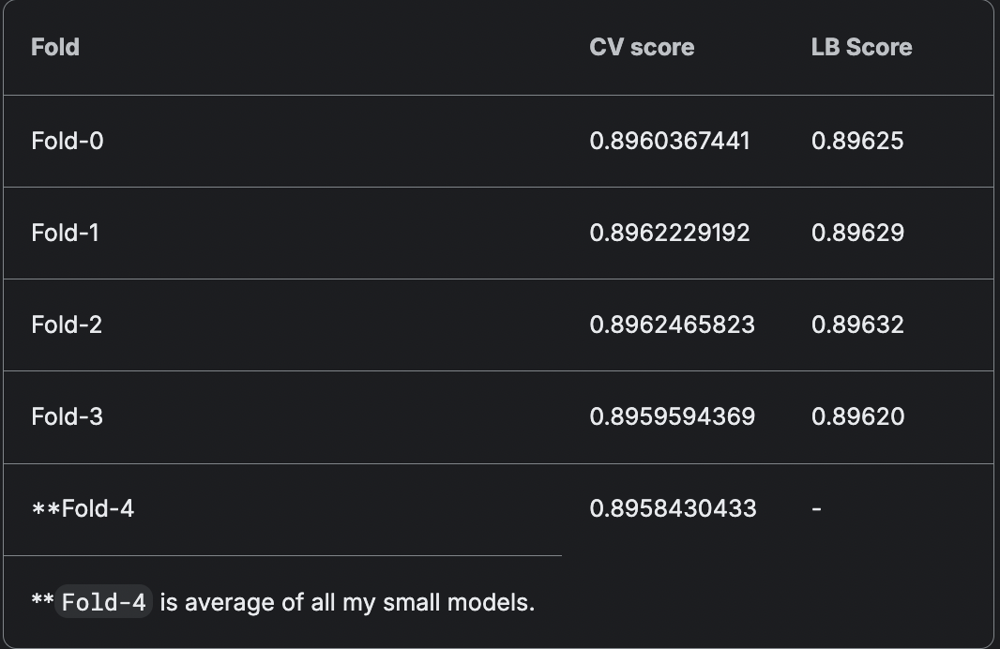

# Winning approach by Team Ujjwal Pandey

Team Members - Ujjwal Pandey

REF: https://www.kaggle.com/competitions/playground-series-s4e7/discussion/523489

## Iteration 1

In my initial attempt, I trained a quick, lightly tuned set of models (XGB, LGBM, and SnapML) on my local PC equipped with an RTX 4070.

- The XGB submission was smooth, achieving a Public LB score of 0.88448 with a CV score of 0.8833.
- I faced a problem with LightGBM CUDA flavor because of this bug [CUDA] illegal memory access. Consequently, I had to drop LightGBM from the first iteration.
- I did not pursue Random Forest or any sklearn libraries, as public discussions and notebooks indicated they were not worth the computational effort
- SnapML usually takes a lot of time on even light datasets but I tried it anyway as it has GPU support but it also achieved an LB score close to 0.8880.

At the end of this iteration, my score was around 0.88. To breach the 0.89 mark, I needed further improvements. I had not yet explored CatBoost, as public forums suggested its default settings could yield scores exceeding 0.895.

## Iteration 2

A determined effort to tune XGB, LGBM, and SnapML to match CatBoost's performance:

- I aggressively tuned XGB and SnapML using distributed Optuna on four machines (2 x Kaggle GPU P100, 1 x L4 from Colab, 1 x RTX 4070 from my local setup). To avoid OOM errors during HPO, I didn't load the test set into memory.
- In this stage I also merged the original dataset and created these four additional interaction features from public notebooks.
  `train_df['Insured_Vehicle_Damage']=  train_df['Previously_Insured'].astype(str) +  train_df['Vehicle_Damage'].astype(str)
train_df['Insured_Vehicle_Age'] =  train_df['Previously_Insured'].astype(str) +  train_df['Vehicle_Age'].astype(str
train_df['Insured_License'] =  train_df['Previously_Insured'].astype(str) +  train_df['Driving_License'].astype(str)
train_df['Insured_License'] =  train_df['Previously_Insured'].astype(str) +  train_df['Driving_License'].astype(str)
train_df['Insured_Gender'] =  train_df['Previously_Insured'].astype(str) +  train_df['Gender'].astype(str)
)`

* The tuned XGBoost achieved a public LB score of 0.89387 with a CV score of 0.89113.
* I tuned LightGBM on CPU using three machines (1 x TPU on Kaggle and 2 x TPUs on Colab). This model achieved a public LB score of 0.89344 with a CV score of 0.89302. A challenge with using TPU on Kaggle is the automatic shutdown after 3 hours when TPU is not consumed, but distributed tuning allowed me to quickly resume training
* Next was SnapML though sadly this model couldn't even breach the 0.890 on my CV and hence I filtered this out after this iteration ☹️.
* After seeing the performance of neural nets from public discussions and notebooks I gave it a try. There's an awesome library pytorch-tabular which I used to train TABNET and GANDALF and they also achieved CV score of ~0.8910 but they are very expensive to train and didn't offered better performance compared to GBDT.

## Iteration 3

- I attempted to use neural embeddings from pytorch-tabular CategoryEmbedding model to boost the scores of LightGBM and XGBoost. This was a mistake, as the embeddings turned out to be close to 300 dimensions, requiring high RAM. An initial spike in my CV score to 0.895 was due to a bug caused by a seed mismatch, which I discovered too late after exhausting my Colab credits ☹️.
- I tried target encoding to some extent but even that wouldn't push the score of XGB or LGBM ☹️ .

At this point, I considered skipping the episode, having exhausted nearly all my compute resources and time with no guarantee of success. With around 30 submissions, I decided to give CatBoost one final attempt.

## Final Iteration

At this stage, I tuned just one catboost model (just one) using again the same strategy distributed optuna on 3 x machines close to 50 HPO rounds, took about 10 hours because unfortunately, catboost GPU doesn't support pruner as compared to XGB and LightGBM. These were my parameters after HPO tuning.

`'learning_rate': 0.11913236771124495,
'reg_lambda': 0.5423732686916918,
'max_depth': 6,
'subsample': 0.9996168133883909,  # I changed this to 1.0 when training full model.
'leaf_estimation_iterations': 10,
'log_max_bin': 15`

These were my fixed params for HPO

`"loss_function": "Logloss",
"eval_metric": "AUC",
"iterations": 3000,
"random_state": 56315,
"bootstrap_type": "Bernoulli",
"grow_policy": "SymmetricTree",
"task_type": "GPU",
"early_stopping_rounds": 100,
"leaf_estimation_method": "Newton",
"use_best_model": True,`

1. I can manually reduce the learning rate to 0.085 and increase the iterations to 10000.

2. Newton-based score_function is superior to Gradient-based. I guess this is what most of the public notebooks missed. As soon as I switched to NewtonCosine or NewtonL2 and used 12 leaf_estimation_iterations my CV itself was close to 0.8960.

   Additionally, I removed contrasting duplicates first from the original and then from both train and original after combining as discussed in this discussion: [https://www.kaggle.com/competitions/playground-series-s4e7/discussion/520253](https://www.kaggle.com/competitions/playground-series-s4e7/discussion/. I also Binned Aged and Premium features as I found it slightly increases my validation scores.
   After experimenting with everything I divided the dataset into 4 folds. I wasn't able to train all the folds together and even training a single fold was not possible on Kaggle as catboost required close to (48 gigs) of RAM post-training.

   I trained the first 3 fold on colab with my remaining computes and the submission this time achieved an LB score of 0.89720 putting me in top 10 but after doing the trick as mentioned by @paddykb it got boosted to 0.89780 .

   To finally settle the score I trained small-small versions of catboost with same parameter and reduced iterations on Kaggle with different CV-spilt and random states and did average solely based on validation scores (as at this point I didn't had OOF folds to properly blend with) which settled my final score without trick to 0.89728 and with the trick to 0.89788 which was the winning solution with private LB score of 0.89753.

These were my final CV-LB scores of the fold without any trick.

## Summary

### Key Takeaways

1. Monitor discussions and public notebooks to save experimentation and compute time, allowing calculated decisions with fewer submissions.
2. Be patient with large datasets and try different training strategies. Mistakes are learning opportunities.
3. Distributed optimization is faster, more affordable, and has better error tolerance, especially in competitions like this.
4. Be wary of leakage, even with changing random states, especially in neural embeddings.

### What Didn’t Work

1. Target encoding with XGB and LGBM.
2. Neural embeddings didn't boost performance enough compared to the compute required.
3. Changing the default max_ctr_complexity of CatBoost overfit in my case.

### What I Could Have Done

1. Saving OOF folds and combining would have boosted my score though I couldn't due to their large size.
2. Exploring neural networks more.
3. Trying different CatBoost flavors (maybe lossguide).
