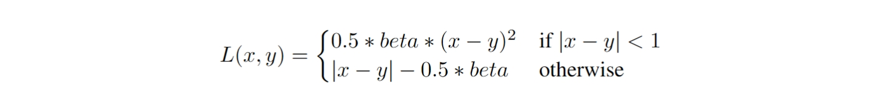
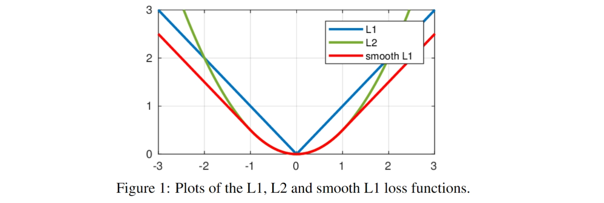

# Winning approach by Z Lab

Team Members - zui0711, takanashihumbert, hookman, max2020, forcewithme

REF: https://www.kaggle.com/competitions/leap-atmospheric-physics-ai-climsim/discussion/523055

## Data and Cross validation

### Training data

Training data is crucial for this competition. According to this GitHub repository, the Kaggle data is sampled from this low-resolution dataset. Utilizing the entire low-resolution dataset can boost performance by almost 0.01 in this competition.

### Cross validation

Our models are trained using data from the first 7 years and the first half (January to June) of year 8, totaling approximately 75 million data points. We set the stride_sample parameter to 7 and used data from July to December of year 8 and January of year 9 as our hold-out validation dataset. This validation set has shown perfect correlation with the leaderboard scores.

## Model optimization

### Smooth L1 loss

The Smooth L1 loss is a robust loss function used primarily in regression tasks, combining the advantages of L2 and L1 losses. It is less sensitive to outliers than L2 and avoids the non-differentiability at zero seen with L1. The function is defined as follows:

This approach helps stabilize the training process and often improves performance in noisy data situations.

### Auxiliary diff loss

We use an auxiliary 'Diff Loss, to enhance learning. This loss calculates the difference between real and predicted values at adjacent levels of a target, using Smooth L1 loss to quantify the error. The approach is implemented as follows:

`with torch.no_grad():
    outputs = model(inputs)
    loss = criterion(outputs, labels)
    for i in range(6):
        output_diff = outputs[:, 8+60*i+1:8+60*(i+1)] - outputs[:, 8+60*i:8+60*(i+1)-1]
        label_diff = labels[:, 8+60*i+1:8+60*(i+1)] - labels[:, 8+60*i:8+60*(i+1)-1]
        loss += criterion(output_diff, label_diff) / 6`

### Cosine annealing scheduler

The cosine annealing schedule adjusts the learning rate in a cosine-shaped curve to help the model escape local minima and improve convergence. We implemented this with learning rate decays at the 3rd and 9th epochs.

### Group fine-tune

During multi-objective learning tasks, different learning objectives can interact in complex ways, promoting or inhibiting each other. Our experiments found that while different target groups initially promoted each other, they began to interfere towards the end of training, potentially due to complex semantic constraints.

Inspired by the top solution from the 2021 VPP competition, we divided 368 features into seven groups, six of which are series of measurements of different metrics along the atmospheric column, and one group consists of eight unique single targets. After the training process with 364 full outputs was completed, we fine-tuned these groups again. This allowed each model with different architectures to achieve an improvement ranging from 0.0005 to 0.0015. Due to time and resource constraints, we only fine-tuned each group for one epoch. @max2020

### Post-processing

After obtaining raw model predictions, we denormalize them using the standard deviation and mean. Following community discussions, we adjust certain variables of ptend_q0002 based on their linear relationships. Finally, we apply the weight values from the official sample submission file to process the predictions.

## Model structure

### Model by Forcewithme

Table 1
The final ensemble strategy contains 6 models of ForcewithMe. These 6 models, the private score, the corresponding architectures, and the corresponding "exp id" in table 2 are in the table above. The model architectures are easy to understand and implement with the corresponding figures and the code. Here are some details and insights:

- All models show local scores and public leaderboard (LB) scores within their model ids, which correspond directly to filenames, model names, and submission files (without extensions). The table supplements these with private LB scores and details on the model architectures.
- All models are primarily built with LSTM as main components. This is due to our finding that LSTMs significantly outperform other architectures such as CNNs, MHSA, NNs, and GRUs in this competition.
- Inspired by ResNet and Transformer, all my models incorporate residual connection. We believe residuals make models converge faster and perform better.
- Figure 3(a) depicts a simple ResLSTM structure, which surprisingly achieved the highest private LB score among all models. Moreover, It took over two weeks for my another submission to beat this residual LSTM model on both local score and on the public leaderboard. Additionally, ResLSTM is still better on the private LB. exp32 has the same architecture to exp 18. The former one resumes the weights of the latter one and applies group fine-tuning.
- Figure 3b illustrates a model combining small kernel convolutions, large kernel convolutions, and LSTMs as encoders, with the encoded results concatenated and fed into an LSTM backbone. This design leverages the presumed relationships between adjacent atmospheric layers, aiming to model local information and positional relations. Although it performs less well offline and on the private LB compared to the pure resLSTM model, it scores higher on the public LB and provides gains during the ensemble.
- The remaining four models combine LSTMs with MAMBA. While LSTMs typically have more layers, MAMBA occupies the same number of layers as the LSTMs in model `forcewithme_gf037_1LSTM1mamba-5_state16_cv0.7896_LBunknown`.
- The models mixing LSTM and Mamba (3d) in every block achieve very good scores offline and on the public LB.
- Despite individual MAMBA-based models not outperforming the pure LSTM structure, they play a significant role in the final ensemble.
- There are two versions of MAMBA available: MAMBA and MAMBA-2 in the "mamba-ssm" package. We exclusively used MAMBA.
- The default parameters for MAMBA are: `d_model=512`, `d_state=16`, `d_conv=4`, `expand=2`. Other than `d_model`, the parameter settings follow the official repository.
- The models `forcewithme_gf037_1LSTM1mamba-5_state16_cv0.7896_LBunknown` have 1 LSTM and 1 MAMBA in each block, and it has 5 blocks, the mamba uses default params setting. While the models `forcewithme_gf_LstmMambaMixed_cv0.7886_lb0.7858` and `forcewithme_gf038_2LSTM1mamba-3_state64` have 2 LSTMs and 1 mamba in each block, and they have 3 blocks.
- The models `forcewithme_gf_LstmMambaMixed_cv0.7886_lb0.7858` and `forcewithme_gf038_2LSTM1mamba-3_state64` differ only in that the latter has d_state set to 64. They share figure 3(d) as they are almost the same.
- For installation and usage of MAMBA, please refer to the official repository: https://github.com/state-spaces/mamba?tab=readme-ov-file. It's licensed under Apache-2.0, allowing for free use, including commercial purposes, provided the license requirements are met.

### Model by Max2020

In the Max2020 part, models 14, 15, 21, and 22 are all improvements based on the model by @forcewithme, integrating LSTM with skip connections. Model 22 is our team’s highest-performing single model, providing the best results in local scoring, Leader Board scoring, and private scoring. Its architecture is shown in Figure 4. Regarding the learning rate schedule, a cosine decay learning rate was used, with decays occurring at 3 and 9 epochs. The loss function employed was the smooth L1 loss with a beta of 0.5. The Table 2 contains the detailed performance of my five models.

### Model by Joseph Zhou

The structure of Joseph's models mainly consists of the use of multi-layers Res-ConvLSTM blocks and a TimeDistributed fully-connected layer. The input size is [bs, 60, 25] and output size is [bs, 368], the last dimension of the input includes 16 sequence-features and 9 scalar-features. After passing the multi-layers Res-ConvLSTM blocks and fully-connected layer, it will result in a size of [bs, 60, 14], the last dimension includes 6 sequence-labels and 8 scalar-labels. For scalar-labels part which is [bs, 60, 8], we just average in the second axis to get the shape of [bs, 8]. For sequence-labels part which is [bs, 60, 6], we reshape it to the shape of [bs, 360]. Finally, we concatenate the two parts to get the output. Besides, a reverse and shift type of augmentation is implemented in one of the models. The idea is we randomly reverse or shift the sequence-features and sequence-labels respectively in the data loader.

### Model by Adam

The structure of Adam's models are like: Inputs -> Position encoding -> 1DCNN -> 3-4 layers LSTM -> 1 layer transformer -> Outputs. Most models used all the low-resolution dataset and the others only use sampling data. The model trained by sampling data can contribute to the ensemble a bit. For the loss, Adam used SmoothL1 loss and auxiliary diff loss as mentioned before. For the scheduler, Adam used ReduceLROnPlateau scheduler with a factor of 0.2 and patience of 2.

Adam's best single model has LB 0.78594 and PB 0.78141. The ensemble of Adam's models has LB 0.79050 and PB 0.78575.

### Model by Zuiye

Zuiye's models are mainly based on two architectures. The first one consists of 2 LSTM layers followed by a MultiheadAttention layer. The other one consists of 3 parallel Convolutional layers with 3 different kernel sizes and next 2 LSTM layers followed by a MultiheadAttention layer just like the first architecture. Zuiye's best single model gets LB 0.78696 / PB 0.78205 and the ensemble of Zuiye's own models (with hill climb) gets LB 0.79050 / PB 0.78614.

### Model ensembling

We use the hill climb method to search blend weights of each model. The steps of hill climb are the following: @hookman

1. Take the best out-of-fold predictions as best_ensemble. This will be our baseline.
2. Iteratively blend best*ensemble with different models with different weights, using the formula new_ensemble = w * best*ensemble + (1-w) * new_oof
3. Check the r2 score of the new ensemble. Choose the best new ensemble to replace best_ensemble as our new baseline.
4. Repeat until the r2 score can't increase anymore or reaches the threshold.

Weights of the best model are shown in the table below:

Table 2

| Exp id            | Weight    | CV      | LB      |   PB    |
| ----------------- | --------- | ------- | ------- | :-----: |
| forcewithme_exp32 | 0.166556  | 0.790   | 0.7865  | 0.78398 |
| forcewithme_exp37 | 0.158625  | 0.7896  | 0.78618 | 0.78293 |
| forcewithme_exp38 | 0.139194  | 0.7897  | 0.78719 | 0.78362 |
| max_exp22         | 0.120125  | 0.7908  | 0.78793 | 0.78434 |
| Jo_exp912         | 0.111971  | 0.78935 | 0.78528 | 0.78150 |
| max_exp21         | 0.104738  | 0.7904  | 0.78752 | 0.78425 |
| forcewithme_exp39 | 0.098977  | 0.789   | 0.78699 | 0.78257 |
| max_exp14         | 0.093088  | 0.7905  | 0.78641 | 0.78214 |
| max_exp10         | 0.092157  | 0.7888  | 0.78619 | 0.78213 |
| forcewithme_exp40 | 0.082941  | 0.7885  | 0.7853  | 0.78261 |
| max_exp015        | 0.052500  | 0.7905  | 0.78695 | 0.78244 |
| adam_exp197       | 0.048994  | 0.7855  | 0.78269 |  0.777  |
| adam_exp200       | -0.047132 | 0.7836  | 0.78010 | 0.77434 |
| adam_exp195       | -0.049875 | 0.78569 | 0.78334 | 0.77753 |
| Jo_exp907         | -0.083779 | 0.7855  | 0.78289 | 0.77873 |
| forcewithme_exp18 | -0.089079 | 0.7890  | 0.7863  | 0.78272 |
| Ensemble          | 1.0       | 0.7955  | 0.79211 | 0.78856 |
