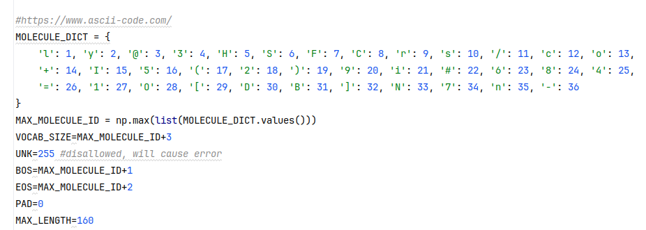
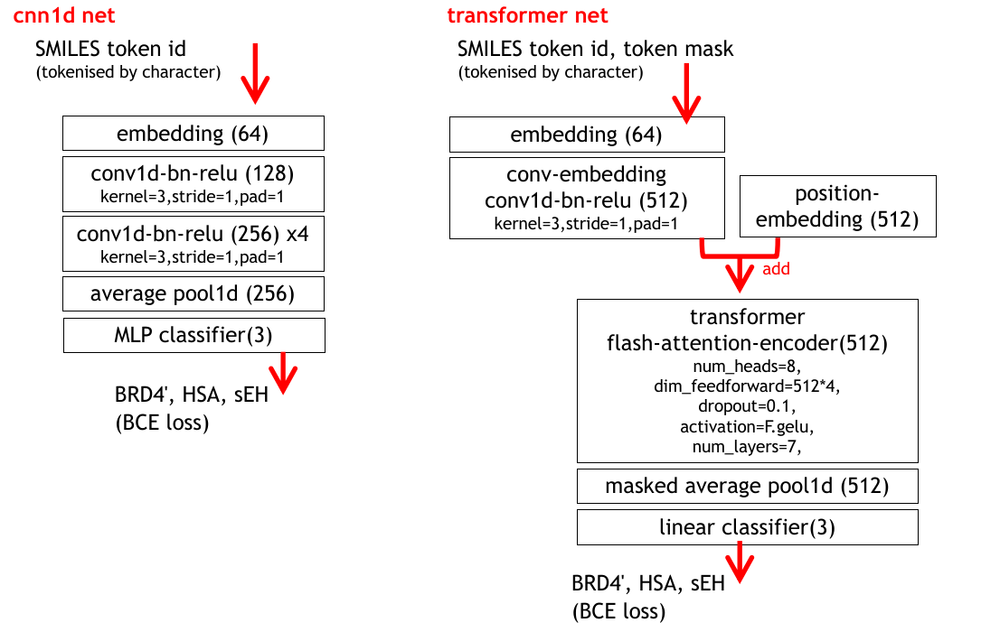
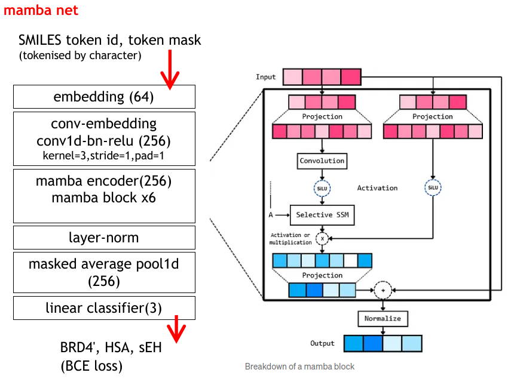
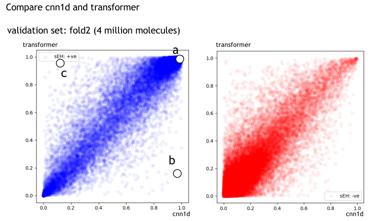
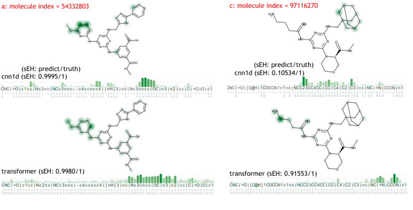
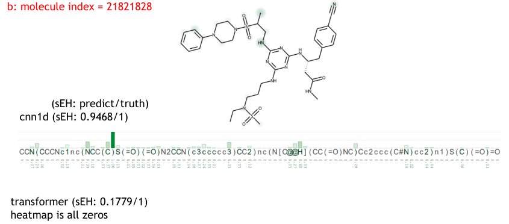

# Winning approach by mamba1-one-fold-lb0.432

Team Members - hengck23

REF: https://www.kaggle.com/competitions/leash-BELKA/discussion/521894

## Brief description of the method:

1.  Tokenization
    We use only character tokenization. we use CNN embedding (kernel size=3, stride=1) to learned combination of characters. We try other tokenizers like BPE, sentence piece, atom/smiles based, etc. But all perform worse than the simplest character-based tokenization.
    

2.  Network architecture
    The final solution is an ensemble of 3 net architectures: cnn1d, transformer, mamba (SSM). We treat input as a sequence and the task as a 3-class ('BRD4', 'HSA', 'sEH') multi-label problem. We train with large batch sizes: cnn1d=5000, transformer=2500, mamba=2000. For cnn1d, performance is very sensitive to BN for large batch sizes. We think it is because of:

        * in-distribution and out-distribution samples have different feature values.
        * class is imbalance (positive class is less than 1%). positive and negative samples also have different feature values.

    We use high eps=5e-3 and low momentum=0.2 for cnn1d net.
    

    

## Key observation:

With 98 million training molecules, it takes quite a lot of time to train each neural net. We do not have sufficient time to train different nets for each fold. Instead, we used different folds for different nets to improve ensemble diversity.

    * 7 hr for cnn1d (one fold)
    * 28 hr for transformer (one fold)
    * 36 hr for mamba (one fold)

This makes it difficult to compare performance for different nets. After the competition, we make some late submissions. Here are the results. It can be seen that the transformer is the most robust net.

Next, we compare some heatmaps generated by gradCAM:

As expected(?) activation of cnn1d is quite local. Transformer has much global activation.

## Acknowledgement

"We extend our thanks to HP for providing the Z8 Fury-G5 Data Science Workstation, which empowered our deep learning experiments. The high computational power and large GPU memory enabled us to design our models swiftly."

## Solution Code: https://github.com/hengck23/solution-leash-BELKA
