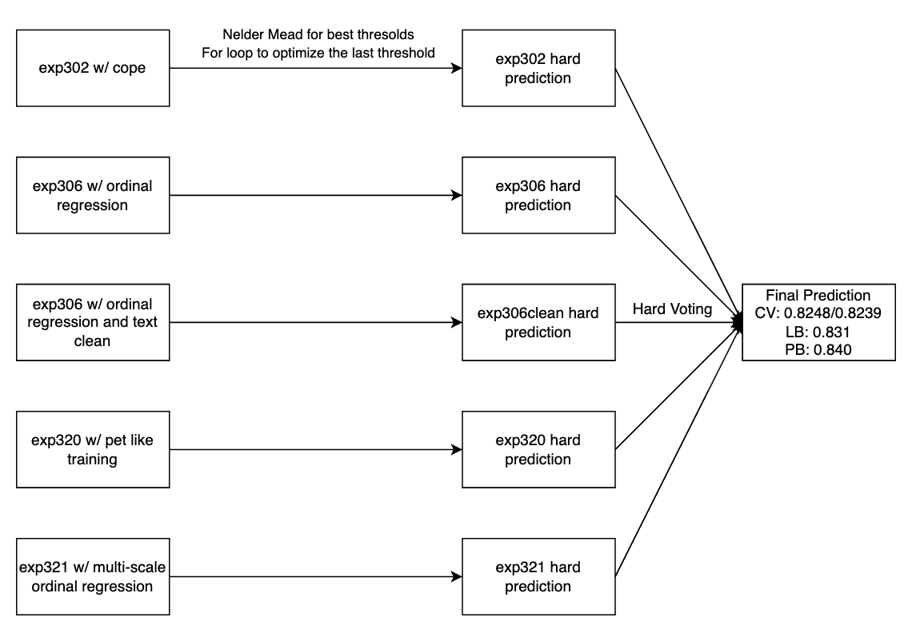

# Winning approach by yao

Team Members - syhens

REF: https://www.kaggle.com/competitions/learning-agency-lab-automated-essay-scoring-2/discussion/516790

## Overview

My final best selected sub is a voting of 5 models, this is a overview of my final best selected solution:

All the models are trained with:

1. Two-Stage Training. Training on Kaggle-Persuade first, load the weights and training on Kaggle-Only with same loss function.
2. 10 epochs of MLM on all the training set.
3. CV: 4 folds SKF. Validate on both Kaggle-Persuade and Kaggle-Only data.
4. Save the checkpoints for the last epoch. (On both stage1 and stage2)
5. Random seed.

Some models trained with Ordinal Regression.

Whose I think are the keys to have high PB.

Why we need two-stage training? IMO, If we train with all the training set, the model will learn the distribution of Kaggle-Persuade more (because it's have big size? I think), this will lead to do bad on Kaggle-Only set. So, use two-stage training to let the model learn the knowledge from Kaggle-Persuade first, then finetine on Kaggle-Only to learn the distribution of Kaggle-Only, which is more similar to our hidden test set.

## Threshold Search

I use OptimizedRounder here to search best thresholds for every single model and blend models. After some experiment, I found the last threshold of 5 and 6 is sub-optimized. So I create a for-loop to search the best last threshold, which boost both CV, LB and PB.

A simple though is to search thresholds on Kaggle-Only dataset only as the texts are more similar to test set. Although it gives much good CV, but LB drop a lot, so I assume the distribution of the score of hidden test set is similar to our full training set. Then I do threshold search on all the training set only, which lead to good LB/PB.

## Models

| Exp name | Description                                                                                                          | CV                        |    LB/PB    |
| -------- | -------------------------------------------------------------------------------------------------------------------- | ------------------------- | :---------: |
| exp302   | cope add CoPE which I edit from paper to simple two-stage training                                                   | 0.8194/0.8158             | 0.827/0.833 |
| exp306   | Ordinal Regression                                                                                                   | 0.8243/0.8148             | 0.829/0.840 |
| exp306   | clean Ordinal Regression with clean text via Feedback1's code                                                        | 0.8248/0.8179             | 0.826/0.836 |
| exp320   | Pet like training.                                                                                                   | 0.8201/0.8174             | 0.828/0.841 |
| exp321   | Mean pool of sentences to get paragraph representation, then mean pool of paragraph to get full text representation. | 0.8209/0.8201 0.824/0.836 |

**exp306**
This model is trained with:

1. backbone: deberta-v3-large mlm10
2. lr: 1e-5
3. head_lr: 5e-5
4. pooling: attention
5. differential learning rate
6. scheduler: linear, warmup: 0.1
7. loss: bce
8. max_length: 1024
9. batch_size: 32
10. epochs: 3

I use BCEWithLogitsLoss to train ordinal regression model

`@torch.no_grad()
def to_labels(labels: torch.Tensor, num_labels):
labels = labels.clone()
labels = labels - 1
B = labels.shape[0]
outputs = torch.zeros((B, num_labels - 1), dtype=torch.float32, device=labels.device)
cols = torch.arange(outputs.shape[1], device=labels.device)
mask = cols < labels.unsqueeze(1)
outputs[mask] = 1
return outputs`

`class AESRegressionModel(nn.Module):
def get_loss_function(self, config):
return nn.BCEWithLogitsLoss(reduction="none")
    def forward(self, x):
        feature = self.get_feature(input_ids=x["input_ids"], attention_mask=x["attention_mask"])
        logits = self.head(feature)
        return logits
    def compute_loss(self, logits, labels, is_pc2=None):
        new_labels = to_labels(labels, self.n_labels)
        loss = self.criterion(logits.reshape(-1, ), new_labels.reshape(-1, ))
        loss = loss.mean()
        return loss`

**exp320**

1. backbone: deberta-v3-large mlm10
2. lr: 2e-5
3. head_lr: 5e-5
4. pooling: attention
5. differential learning rate
6. scheduler: cosine, warmup: 0.1
7. loss: bce
8. max_length: 1024
9. batch_size: 16
10. epochs: 2

The model structure is from my previous teammate @conjuring92 @trushk , they used and shared in Feedback3 here. My prompt for pet model is: `Data Source: {topic}\n\nStudent Writing Evaluate\n\nThe score(1 to 6) of the following essay is: [MASK].`

Different from exp302, I scale the score from 1-6 to 0-1 and use bce loss to train. When evaluation, I simple do: pred \* 5 + 1 to transform the prediction to original scale, which works quiet well.

**exp321**

1. backbone: deberta-v3-large mlm10
2. lr: 1e-5
3. head_lr: 1e-5
4. pooling: attention
5. differential learning rate
6. scheduler: linear, warmup: 0.1
7. loss: mse
8. max_length: 1024
9. batch_size: 16
10. epochs: 2

Mean pool of sentences to get paragraph representation, then mean pool of paragraph to get full text representation.

I also use ordinal regression here.

## Submission Selection

It's very difficult to select the best sub, CV/LB only have good correlation with some of my single models.

For this competition, I wanted the sub to be as robust as possible. So I chose one for best LB (voting). For the other sub, I focused on Kaggle-Only CV, (because CV/LB correlate good for tree-based only models(CV/PB correlate very well!) and some of my single models), which is a weighted blend and have CV around 0.828+. The result is not bad.

## Things doesn't work

- classification
- weighted blend. yes… although I finally select sub with ensemble, many high PB subs are simple mean blend(all 0.842 to 0.844). and I have single best model 0.841, but ensemble drop to 0.840…
- Reina. I like reina, but it didn't work here. That's search the most similar text B of focus text A, and concat B, score of B and A to train.
- Add elements of each token
- Separated head training.
- Stacking
- MoE
- Ranking loss
- AWP

Training code update: https://github.com/Syhen/2nd-Place-Solution-Kaggle-Learning-Agency-Lab-Automated-Essay-Scoring-2.0

Inference notebook: https://www.kaggle.com/code/syhens/aes2-voting?scriptVersionId=184408611
