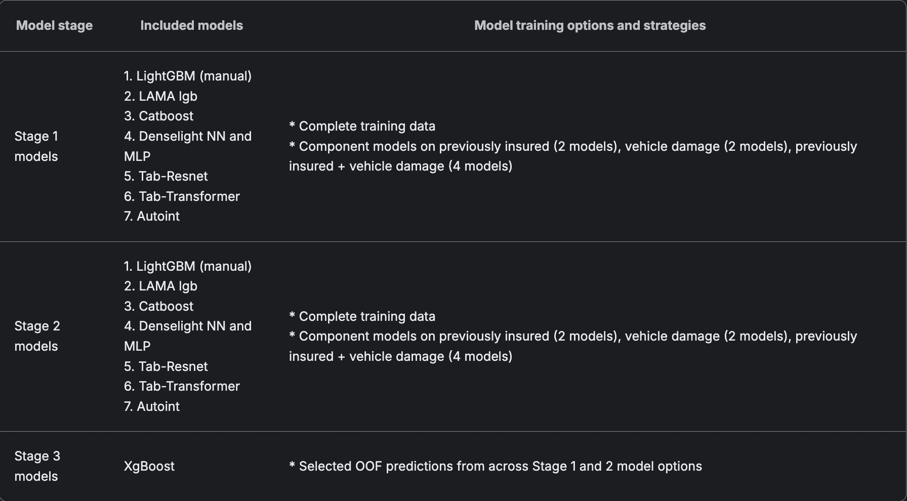
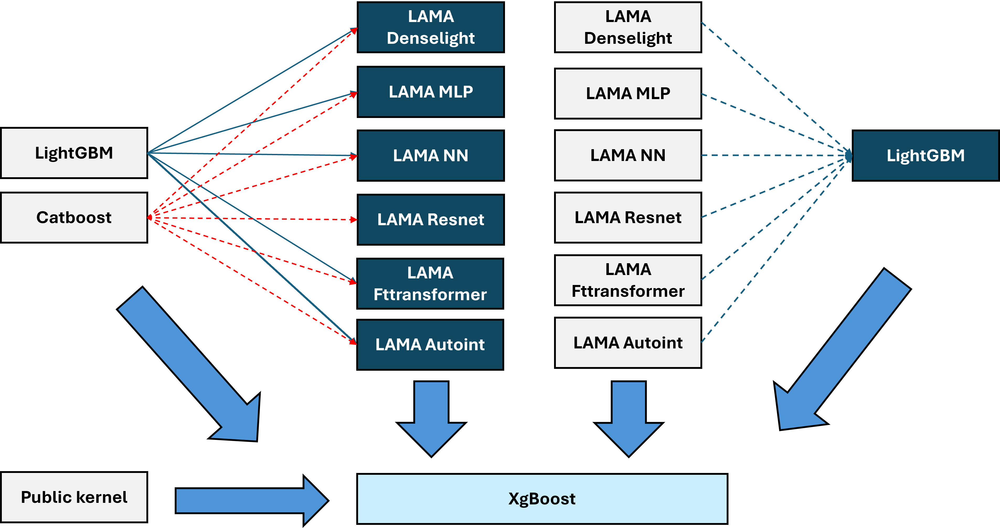
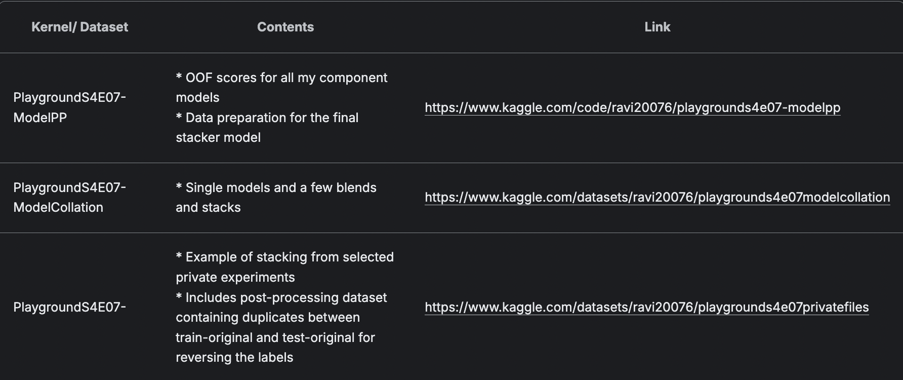

# Winning approach- Team Cross Sellers

Team Members - Ravi Ramakrishnan, Minato Namikaze
REF: https://www.kaggle.com/competitions/playground-series-s4e7/discussion/523404

## Strategy overview

1. We realized since the start of the episode that this dataset has a near-perfect CV-LB relation and the size of the data makes it almost perfectly insulated from overfitting risks.
2. This assignment necessitated baroque GPU resources for efficient model development and experimentation. We decided not to use Kaggle free resources and relied on better GPU hardware including A6000x2, A6000Adax2, A100 and A5000x2, RTX4090, RTX3090 (local PC) for our interim experiments
3. We were well aware of the advantages of using neural networks in this assignment. We used a number of neural networks herewith and all our attempts at this were highly successful
4. Time management and resource management were key in this assignment. Model training had to be on-point and ensembles had to be managed well for memory resources and time to completion as well. We planned to blend a number of diverse models in our final ensemble and rely on the same CV scheme throughout the competition to foster effective model comparison
5. Data organization was key to our success herewith. We resorted to a standard file and model naming convention, tracked experiments regularly and were in-control of individual CV-LB scores as well, enabling us to choose the right mix of models in our final ensemble. Small, but pertinent steps like file naming standardization, code automation, usage of a well organized GitHub repository and a planned feature-store design with CV-oriented feature inclusion helped us with a robust, quick, effective and meaningful model training regime
6. We believed that using diverse training datasets, multiple feature combinations, multiple model parameters and options and a diverse combination of neural network architectures with boosted tree models will yield results and perhaps our belief prevailed! We resorted to 3 training dataset ideas in this assignment -

- Training data from the competition only (fully ignored the supplementary dataset)
- Training data created from the competition and supplementary dataset
- Training data from the competition, with the supplementary dataset added to each fold in entirety- this approach boosted our CV to the maximum
- We consistently used the below cv scheme -
  `StratifiedKFold(n_splits = 5, shuffle = True, random_state =42)`

## Feature engineering

1. We borrowed ideas from the topper posts in the AutoML component of the competition, but tested the features on the competition synthetic training data only (to avoid bias from the supplementary data). We resorted to testing the feature importance on a single fold only using a simple catboost model consistently.
2. We designed feature stores to collate our feature ideas and created ready-to-use datasets for all further experiments at the end of this step. An illustration of this store is in the kernel here. Our actual feature store consists of 12 versions (Version V1-V12), this kernel is an illustration only.
3. Using such a centralized feature store with tried-and-tested features helped us iterate through our brute-force experiments well and quickly

## Model training process

We resorted to a 3-step training process for the assignment illustrated as below-

This can be visualized as below -

### Key notes

1. We used the public kernel outputs from the work here
2. We did not use XgBoost and max_bins in our weak learners
3. We stacked tree models with neural networks and vice-versa
4. XgBoost stacker as the last step was the most effective option for CV-LB relations
5. We did not use max_bins anywhere in our process, except for the public kernel outputs
6. We used 78 weak learners in our final model and trained more than 125 experiments through the month.

### Adjutant artefacts

We have made our single models and a few selected stacks and blends public. Feel free to use the kernels and datasets as below-

### Post-processing

1. We discovered the target reversals discussed here on day 1 and used it in the auto ML submission as well.
2. All our submissions included the target reversal post-processing throughout
3. Both our final submissions retained the post-processing elements

### What worked for us

1. Effective time management and resource allocation across single models and ensembles
2. Catboost -this was the best single model and in conjunction with category_features, proved to be the best single model option
3. All neural network options worked well for us. Stacking them with Catboost models boosted our CV-LB together
4. LightGBM was also highly effective here and provided a good boost to the final stack with diversity
5. Using the public kernel helped us a bit towards the end of the competition

### What did not work for us

1. Catboost stacker
2. Linear approaches, Optuna, Hill Climb
3. XgBoost weak learners -they were good in isolation but did not improve the final CV score when we included them in the final model
4. Harmonic mean/ GM generalization
5. LAMA dense model - they caused memory overflows with stacking approaches

### Key takeaways

1. Time and resource management is key in such assignments- effective experiment tracking is key. MLOps is important for Kaggle as well, though this is not directly tested and evaluated
2. Committing resources to a competition is necessary when required. Using better resources enabled us to experiment better
3. Sometimes deviating from the norm is important- not using XgBoost stage 1 model benefitted us a lot

### Concluding remarks

1. We extend sincere wishes to one and all and hope to see you all in the next episode!
2. We may opine that we have a lot of untapped signal in the dataset even now, despite our collective effort over a month. Perhaps one may consider working on the dataset should time prevail and improve the score from here onwards
