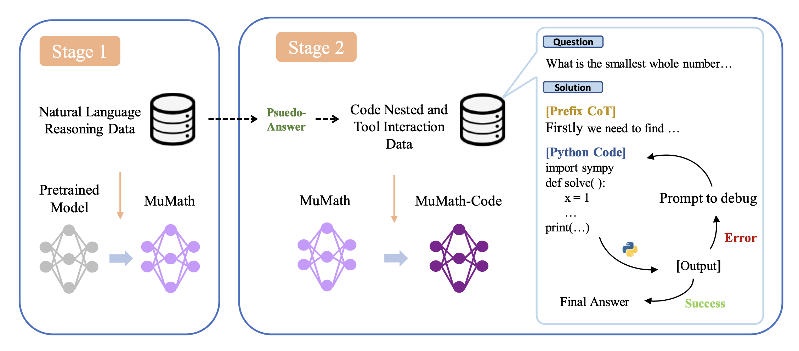
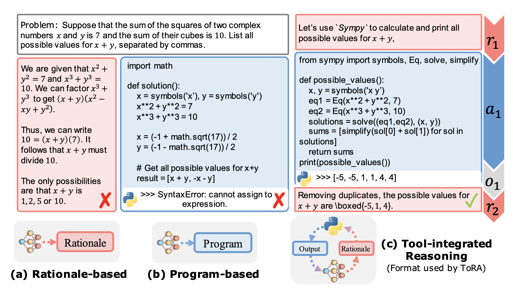
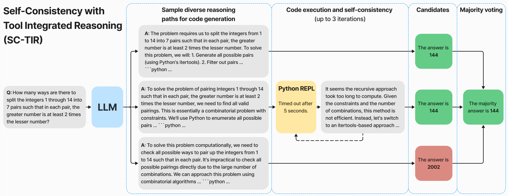
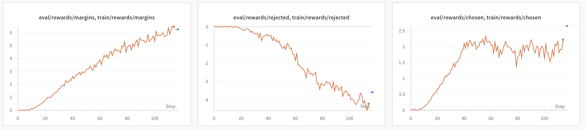
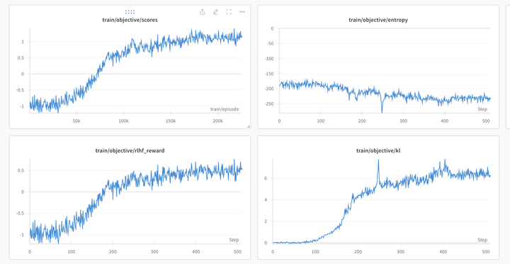

# Winning approach by Numina

Team Members - Jia Li, Edward Beeching, Lewis Tunstall, Hélène Evain

REF: https://www.kaggle.com/competitions/ai-mathematical-olympiad-prize/discussion/519303

## Overview

Solution consisted of three main components:

a recipe to fine-tune DeepSeekMath-Base 7B to act as a “reasoning agent” that can solve mathematical problems via a mix of natural language and the use of the Python REPL.
a decoding algorithm for tool-integrated reasoning (TIR) with code execution feedback to generate solution candidates during inference.
a variety of internal validation sets that we used to guide model selection and avoid overfitting to the public leaderboard.
You can find a collection of the models, demo, and validation sets on the Hugging Face Hub here - we will release the training data and code very soon!

We used a mix of open-source libraries to train our models, notably TRL, PyTorch, vLLM, and DeepSpeed. On one node of 8 x H100 GPUs, our models took 10 hours to train.

## The training recipe

Links:

1. Our final model: AI-MO/NuminaMath-7B-TIR
2. Our model for Kaggle in quantized 8-bit precision: AI-MO/NuminaMath-7B-TIR-GPTQ

Our fine-tuning recipe was largely based on the MuMath-Code paper, which involves training the model in two stages:

- Stage 1: fine-tune the base model on a large, diverse dataset of natural language math problems and solutions, where each solution is templated with Chain of Thought (CoT) to facilitate learning.
- Stage 2: fine-tune the model from Stage 1 on a synthetic dataset of tool-integrated reasoning, where each math problem is decomposed into a sequence of rationales, Python programs, and their outputs. Here we followed Microsoft’s ToRA paper and prompted GPT-4 to produce solutions in the ToRA format with code execution feedback. Fine-tuning on this data produces a reasoning agent that can solve mathematical problems via a mix of natural language reasoning and use of the Python REPL to compute intermediate results (see screenshot below).

In both stages, we performed “full fine-tuning” where all weights of the model are updated during backpropagation. In other words, we did not use parameter efficient techniques like LoRA or DoRA because we were not confident they could match the performance of full fine-tuning without significant experimentation. To accelerate training, we used the “packing” feature from TRL’s SFTTrainer to concatenate multiple samples in a single chunk of 2048 tokens. All models were trained with gradient checkpointing and sharded with the DeepSpeed ZeRO-3 protocol to ensure the weights, gradients, and optimizer states could fit within the available VRAM. See below for the main hyperparameters we used in each stage:

|                  | Stage 1  | Stage 2  |
| ---------------- | -------- | :------: |
| Learning Rate    | 2.00E-05 | 2.00E-05 |
| Total Batch Size | 32       |    32    |
| Block Size       | 2048     |   1024   |
| Num Epochs       | 3        |    4     |
| LR Scheduler     | cosine   |  cosine  |
| Warmup Ratio     | 0.1      |   0.1    |

Our initial submissions used DeepSeek 7B models that were only fine-tuned on Stage 1, but we found the performance was quite limited, with 8/50 being our best score on the public leaderboard using maj@32. It was Abdur Rafae’s public notebook that prompted us to take a look at integrating code execution in the training recipe and initially, we focused on the Mix of Minimal Optimal Sets (MMOS) dataset as this was described in the title of the notebook. We found that using MMOS improved performance, but was still capped at 16/50 on the public leaderboard with maj@32, likely due to the fact that MMOS only consists of single-turn solutions (i.e. the model only generates a single Python program which is insufficient for hard problems). We later realized that MMOS was a misnomer and that Kaggle notebooks were actually running the DeepSeekMath 7B RL model which is capable of multi-step reasoning and code execution.

It was at this point that we focused our efforts on producing a dataset similar to the one used by the DeepSeekMath Instruct / RL models, and this together with the MuMath-Code recipe led to significant improvements.

We also experimented with fine-tuning on integer-only solutions for Stage 2, but found the model was slightly more robust when training on all solution types (likely due to the limited number of samples left after filtering).

## Self-Consistency with Tool-Integrated Reasoning (SC-TIR)

As other competitors noted, this competition posed several challenges with respect to model submission and evaluation:

The evaluation API provides problems in random order, so tactics like early stopping produce high variance because one run may have more hard problems at the start which leaves less time for the remainder (and vice versa)
Most innovation in LLM inference requires access to modern GPUs, so standard methods like Flash Attention 2 or torch.compile do not work on the T4 GPUs. Similarly, modern data types like bfloat16 are not supported which prompted us to explore post-training quantization methods like AWQ and GPTQ.

Initially, we used Abdur Rafae’s public notebook for our submissions but found the high variance to be problematic. To handle this, we took a different approach based on extending self-consistency decoding with tool-integrated reasoning (SC-TIR):

1. For each problem, copy the input N times to define the initial batch of prompts to feed vLLM. These effectively define the number of candidates one uses for majority voting.
2. Sample N completions until a complete block of Python code is produced.
3. Execute each Python block and concatenate the output, including tracebacks if they appear.
4. Repeat M times to produce a set of reasoning traces with width N and depth M. If a trace fails to produce sensible outputs (e.g. incomplete code blocks) we prune that trace.
5. Postprocess the solution candidates and then apply majority voting to select the final answer

For our winning submission, we generated N=48 candidates with a depth of M=4. Increasing either parameter did not improve performance and we took a conservative approach to stay within the time limit. In effect, this algorithm lies somewhere in between Self-Consistency with CoT and Tree of Thoughts (shown below), but doesn’t include backtracking or looking ahead to plan the next step of decoding.

We found that SC-TIR improved overall performance and produced significantly less variance on both our internal evaluations and the public leaderboard.

One technical detail worth mentioning is that we found it helpful to quantize the models in 8-bit precision. This was for two reasons:

- It is very slow to upload models to the Kaggle Hub and compressing the model made this step twice as fast.
- A 16-bit model consumes approximately 32GB VRAM just to load the weights. With 2xT4s, this would have required manipulating the KV cache to run fast and we found it beneficial to tradeoff model precision for speed.

We quantized our models using AutoGPTQ along with the training datasets for calibration. In practice, this led to a small drop in accuracy, but was mostly mitigated by being able to generate many candidates during inference.

## Good validation sets are all you need

Links:
https://huggingface.co/datasets/AI-MO/aimo-validation-aime
https://huggingface.co/datasets/AI-MO/aimo-validation-amc
https://huggingface.co/datasets/AI-MO/aimo-validation-math-level-4
https://huggingface.co/datasets/AI-MO/aimo-validation-math-level-5

To guide model selection, we used four internal validation sets to gauge the performance of our models on math problems of varying difficulty:

1. AMC: we picked all the problems from years 2022 and 2023 of AMC12 and kept those that can be converted to integer outputs. This results in a dataset of 83 problems. This validation set was designed to mimic the private test set on Kaggle and we found our models could solve about 60-65% of these problems. To measure the variance we ran each evaluation with 5-10 different seeds and typically saw variations of around 1-3% with our TIR algorithm.
2. AIME: we picked all the problems from AIME 22, AIME 23, and AIME 24 to measure how well our models could perform on difficult problems, as well as to gauge the most common failure modes. As above, we ran each evaluation with 5-10 seeds to measure variation.
3. MATH levels 4 & 5: we were worried the Medium/Hard validation sets were too small to give a reliable signal, so we also filtered the level 4 and 5 samples from the MATH test set for those with integer solutions. This gave about 750 problems per level to evaluate on and we did so with a single seed per model.

By using these four validation sets, we were able to pick the most promising models across different training stages and narrow down the choice of hyperparameters. We found that combining small, but representative validation sets with larger ones was useful in this particular competition where each submission is subject to some stochasticity from sampling.

## Other ideas we tried

As mentioned above, we tried a few approaches that were ultimately discarded in favor of the MuMath-Code recipe:

- Training a pure CoT model and using majority voting for evaluation
- Training an MMOS model to solve problems with Python in a single step

Another technique we tried was applying Kahneman-Tversky Optimisation (KTO) to new completions sampled from the SFT model. Here the approach was similar to OrcaMath, namely:

- Sample 4 completions per problem with the SFT model, using interleaved rationales and code execution. We used the SFT dataset from Stage 2 as the source of prompts.
- Extract the answer and compare it with the ground truth. If correct, label the sample as positive, else negative.
- Apply KTO to the SFT model on this dataset

We found this form of on-policy KTO produced a better model than the SFT one (a few percentage points on our internal evaluations) and scored 27/50 on the public leaderboard. One nice feature of KTO is that you can track the implicit reward during training and this really helps with debugging a run - for example, here’s one of our successful training logs from Weights and Biases where one sees the chosen (i.e. correct) rewards increase over training, while the rejected ones are suppressed.

Unfortunately, we ran out of time to apply this method to our final SFT model, so it is possible we may have solved 1-2 more problems!

We also experimented with applying our SFT recipe to larger models like InternLM-20B, CodeLama-33B, and Mixtral-8x7B, but found that (a) the DeepSeek 7B model is very hard to beat due to their continued pretraining on math, and (b) inference is very slow and we experienced several mysterious timeouts that we couldn’t trace the root cause of.

Another failed experiment includes trying to use reinforcement learning (specifically the REINFORCE-leave-one-out (RLOO) algorithm) with code execution feedback and a discrete reward for correct/incorrect solutions. We applied this to the DeepSeekMath 7B RL model but did not see any significant gains in performance. Given that online methods like RLOO are bottlenecked by text generation and slow to iterate with, we abandoned reinforcement learning in favor of KTO.

On the inference side, we also experimented with:

- Using a static KV cache and torch compilation. We found we were able to speed up generation in native transformers code by 2-3x on a H100, but hit a variety of cryptic errors on the Kaggle T4s, mostly due to the lack of support for model sharding with torch compilation in Hugging Face accelerate.
- A variety of model merging techniques like DARE, TIES, and WARP. Here we used mergekit (https://github.com/arcee-ai/mergekit) to merge the SFT and KTO models, or the SFT models with the public DeepSeekMath ones. Overall we found these merges led to either significant regressions on our internal evaluations or we ran out of time to explore this more deeply.

## Closing thoughts

We greatly enjoyed participating in this competition and learned a lot from the experience. For future progress prizes, we think it would be possible to increase the performance of open LLMs even further by enabling:

- Evaluation on modern GPUs like A100s or H100s. As noted earlier, much of the recent progress in LLM inference optimization relies on the newer compute architectures and data types, and using GPUs with more VRAM would enable people to experiment with more powerful models.
- Relaxing the pretrained model cutoff date to the start date of the competition. With the current pace of LLM development, this would enable competitors to use the most powerful open LLM available and provide a better measure of how far we are compared to human baselines or proprietary models.

Solution Code: 
Model: https://huggingface.co/AI-MO/NuminaMath-7B-TIR
Demo: https://huggingface.co/spaces/AI-MO/math-olympiad-solver
